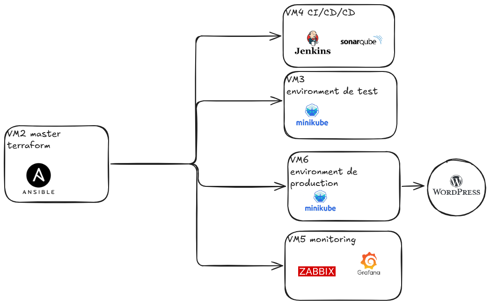

## About this project

# dentist_deployment

<picture>
 <source media="(prefers-color-scheme: dark)" srcset="YOUR-DARKMODE-IMAGE">
 <source media="(prefers-color-scheme: light)" srcset="YOUR-LIGHTMODE-IMAGE">
 
</picture>

| Nom de la VM         | Adresse IP        | Applications déployées                            | Ports exposés               | Rôle / Remarque                    |
|----------------------|-------------------|----------------------------------------------------|-----------------------------|------------------------------------|
| VM1 (WordPress)      | 192.168.8.118     | WordPress, MariaDB                                | 80 (HTTP), 3306 (MySQL)     | Serveur Web WordPress              |
| VM2 (Ansible/Terraform) | 192.168.8.119 | Ansible, Terraform, SSH                            | 22 (SSH)                    | Orchestrateur / Provisionnement    |
| VM3 (Test)           | 192.168.8.120     | Minikube                                           | 8443 (API Server), autres   | Environnement de test Kubernetes  |
| VM4 (CI/CD)          | 192.168.8.121     | Jenkins, SonarQube                                 | 8085 (Jenkins), 9000 (SonarQube) | CI/CD                             |
| VM5 (Monitoring)     | 192.168.8.122     | Grafana, Zabbix                                    | 3000 (Grafana), 10051 (Zabbix server) | Supervision                       |
